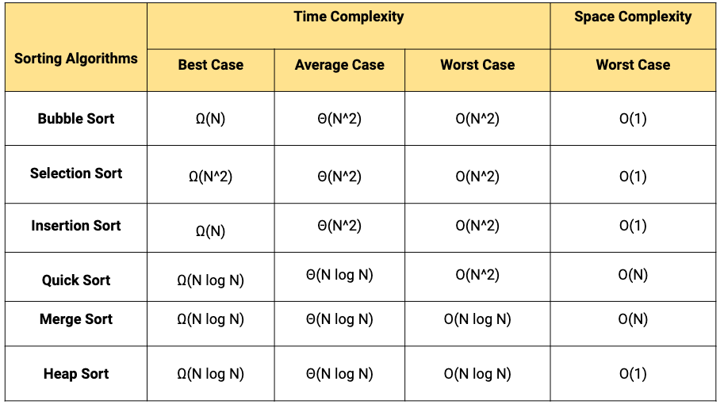
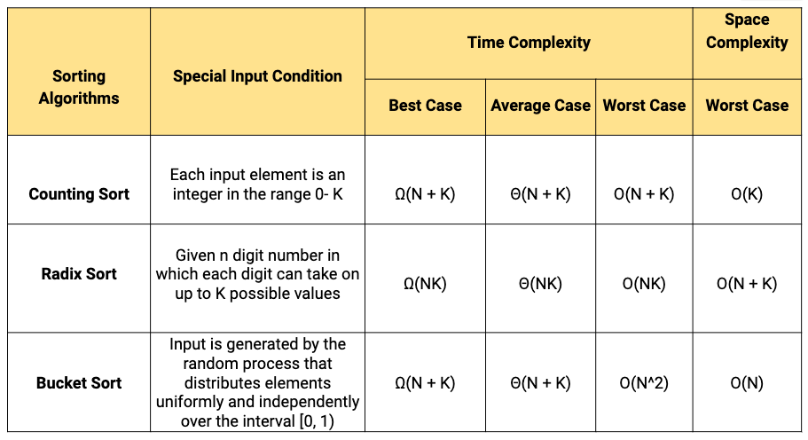
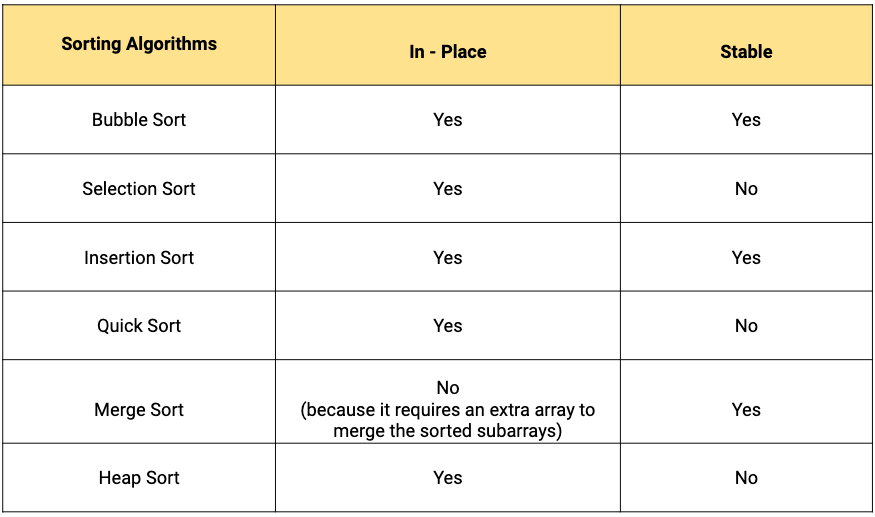

# Comparison based sorting algorithms

# Non-comparison based sorting algorithm

# In-place and Stable sorting Algorithms

- A sorting algorithm is **In-place** if the algorithm does not use extra space for manipulating the input but may require a small though nonconstant extra space for its operation. Or we can say, a sorting algorithm sorts in-place if only a constant number of elements of the input array are ever stored outside the array.

- A sorting algorithm is **stable** if it does not change the order of elements with the same value.

	**Online/Offline:** The algorithm that accepts a new element while the sorting process is going on, that algorithm is called the online sorting algorithm. From, the above sorting algorithms, the insertion sort is online.

If stability is important and space is available, the merge sort might be the best choice for the implementation.

When the input array is almost sorted or input size is small, then the insertion sort can be preferred.

[Why Quick Sort preferred for Arrays and Merge Sort for Linked Lists? - GeeksforGeeks](https://www.geeksforgeeks.org/why-quick-sort-preferred-for-arrays-and-merge-sort-for-linked-lists/)

[How to Merge Sort A Linked List | Baeldung on Computer Science](https://www.baeldung.com/cs/merge-sort-linked-list)

[Merge Sort for Linked Lists - GeeksforGeeks](https://www.geeksforgeeks.org/merge-sort-for-linked-list/)

[Know Your Sorting Algorithm | Set 1 (Sorting Weapons used by Programming Languages) - GeeksforGeeks](https://www.geeksforgeeks.org/know-sorting-algorithm-set-1-sorting-weapons-used-programming-languages/)

[Data Structures Easy to Advanced Course - Full Tutorial from a Google Engineer - YouTube](https://www.youtube.com/watch?v=RBSGKlAvoiM)

[External sorting - Wikipedia](https://en.wikipedia.org/wiki/External_sorting)

[CSC 541: Spring 2020 Schedule (ncsu.edu)](https://www.csc2.ncsu.edu/faculty/healey/csc541/)

[6.851: Advanced Data Structures (mit.edu)](https://courses.csail.mit.edu/6.851/)

[6.854/18.415J: Advanced Algorithms (mit.edu)](http://courses.csail.mit.edu/6.854/20/)

